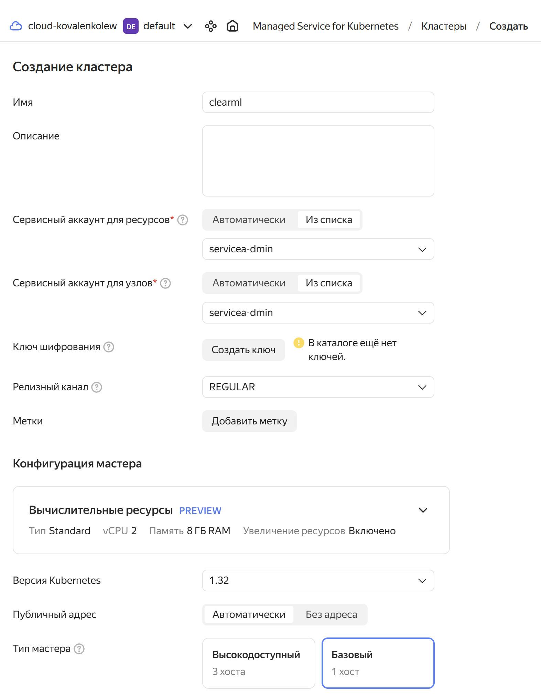
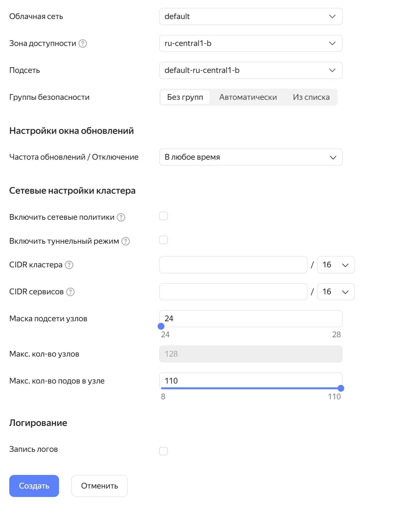
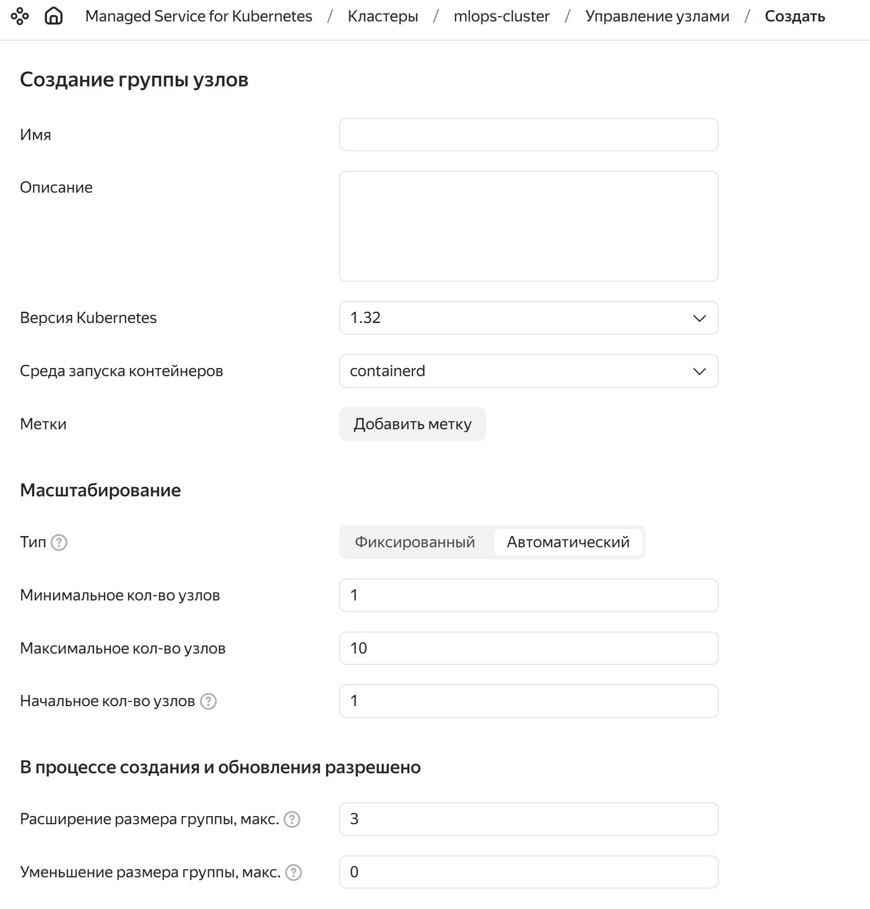
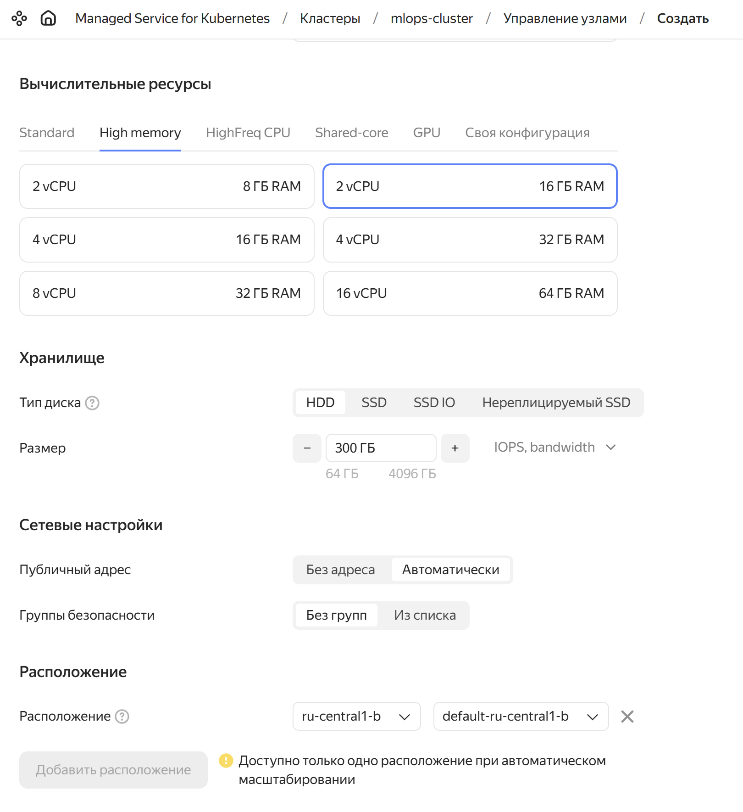
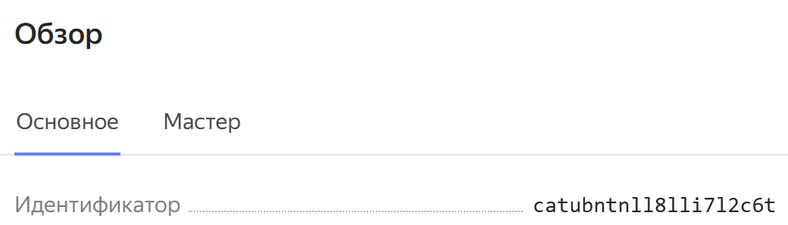

# Настройка Yandex Kubernetes
[Общая инструкция по настройке Yandex Kubernetes](https://yandex.cloud/ru/docs/managed-kubernetes/quickstart)

## Создание кластера Kubernetes

Создайте кластер вот с такой конфигурацией:


Создайте В нем группу узлов вот с такой конфигурацией:


## Установка yc
[Инструкция по установке от yandex](https://yandex.cloud/ru/docs/cli/operations/install-cli)

Скачайте скрипт установки и запустите:
```bash
curl -sSL https://storage.yandexcloud.net/yandexcloud-yc/install.sh | bash
```

Получите ваш [OauthToken](https://yandex.cloud/ru/docs/iam/concepts/authorization/oauth-token) и задайте его yc.
```bash
yc config set token <OAuth-токен>
```

## Установка kubectl
[Инструкция по установке от Kubernetes](https://kubernetes.io/ru/docs/tasks/tools/install-kubectl/)

Скачайте к себе собранный бинарник kubectl
```bash
curl -LO https://dl.k8s.io/release/v1.33.0/bin/linux/amd64/kubectl
```

Измените права для исполнения kubectl
```bash
chmod +x ./kubectl
```

Переместите его в системную папку bin
```bash
sudo mv ./kubectl /usr/local/bin/kubectl
```


## Настройка доступов kubectl
Настройте доступ к kubectl к кластеру
```bash
yc managed-kubernetes cluster get-credentials --id <Cluster ID> --external
```



Проверьте что все работает 
```bash
kubectl config view
```
или
```bash
kubectl get nodes
```

## Установка Helm
Скачайте скрипт установки (см инструкцию [helm](https://helm.sh/docs/intro/install/))
```bash
curl -fsSL -o get_helm.sh https://raw.githubusercontent.com/helm/helm/main/scripts/get-helm-3
```
Измените права для запуска
```bash
chmod 700 get_helm.sh
```
Запустите установку 
```bash
./get_helm.sh
```

## Настройка доступов helm
Что бы подключить helm к yc выполните команду, воспользуйтесь своим [OauthToken](https://yandex.cloud/ru/docs/iam/concepts/authorization/oauth-token)
```bash
helm registry login registry.yandexcloud.net -u oauth
Password: <OAuth-токен>
```