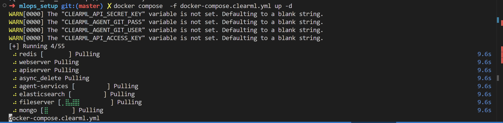
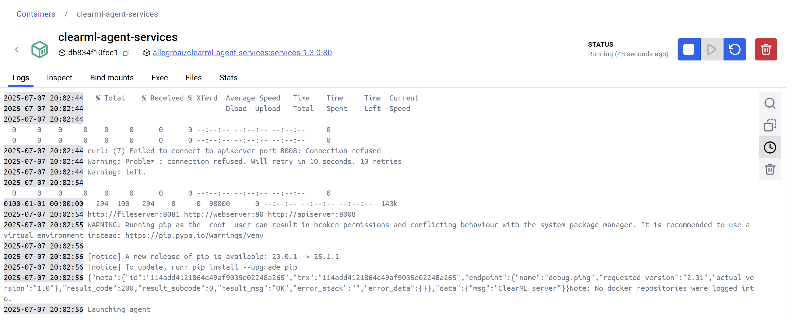
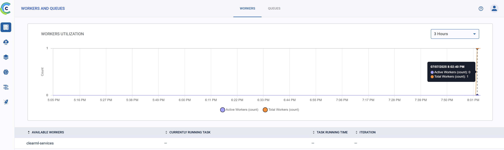

# ClearML docker compose run
Те у кого не завелся кубер могут попробовать запустит это через docker (для командной работы лучше это сделать на виртуальной машине в YC).

Все настройки будут происходить в папке [docker](./docker/). Сначала вам нужно скорректировать конфигурацию, для этого в файле [clearml_config/apiserver.conf](./docker/clearml_config/apiserver.conf) укажите список пользователей по шаблону для работы с ClearML.

Теперь вы можете запустить docker-compose:
```bash
docker compose up -d 
```

У вас выпадут ошибки связанные с clearml-agent, что у него отсутствуют переменные:

- `CLEARML_API_ACCESS_KEY: ${CLEARML_AGENT_ACCESS_KEY:-}`
- `CLEARML_API_SECRET_KEY: ${CLEARML_AGENT_SECRET_KEY:-}`
- `CLEARML_AGENT_GIT_USER: ${CLEARML_AGENT_GIT_USER}`
- `CLEARML_AGENT_GIT_PASS: ${CLEARML_AGENT_GIT_PASS}`



Поэтому сначала настройте все согласно [3. clearml_work.md](./3.%20clearml_work.md) а затем вернитесь к агенту
и заполните пропуски, вместо git user name и password, можно использовать `access token`.
```bash
export CLEARML_AGENT_ACCESS_KEY="access key"
export CLEARML_AGENT_SECRET_KEY="secrete key"
export CLEARML_AGENT_GIT_USER="git username"
export CLEARML_AGENT_GIT_PASS="git user password"
```
Тогда вы увидите такую картину в логах контейнера агента:


А также во вкладке `WORKERS AND QUEUES` появится один активный воркер.


Так же агента можно попробовать [запустить на google_colab](https://clear.ml/docs/latest/docs/guides/ide/google_colab/).

Для его более тонкой настройке добавляйте различные [переменные окружения](https://clear.ml/docs/latest/docs/clearml_agent/clearml_agent_env_var/) в docker compose. Наиболее полезные: 
- `CLEARML_DOCKER_IMAGE` или `CLEARML_AGENT_DEFAULT_BASE_DOCKER` для указания базового образа docker.