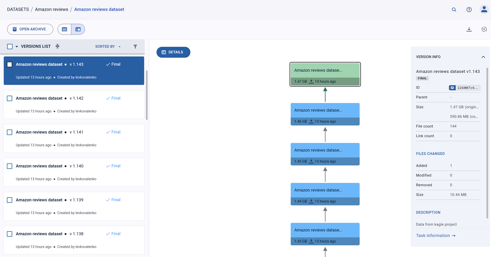

# ClearML Data
В примере для загрузки начальных данных использовался скрипт `mlops-example/1.upload_dataset.ipynb`. Для того что бы он работал скачайте датасет [Amazon reviews](https://www.kaggle.com/datasets/kritanjalijain/amazon-reviews) и разархивируйте его в папку `mlops-example/data`.

Откройте `mlops-example/1.upload_dataset.ipynb` и начните его выполнение.

1. В самом начале он создает пустой [Clearml Dataset](https://clear.ml/docs/latest/docs/hyperdatasets/dataset/) (мы рассмотрим работу через [SDK](https://clear.ml/docs/latest/docs/clearml_data/clearml_data_sdk), но есть еще и [CLI](https://clear.ml/docs/latest/docs/clearml_data/clearml_data_cli)), который мы будем постепенно наполнять данными из данных `Amazon reviews`. Вы сможете найти ваш датасет в разделе `/datasets`: [http://51.250.106.18:30080/datasets](http://51.250.106.18:30080/datasets). 
```python
dataset = Dataset.create(
    dataset_name="Amazon reviews dataset",
    dataset_project="Amazon reviews",
    dataset_version="1.0",
    description="Data from kagle project",
)
dataset.finalize()
```

2. Разбивает обучающую выборки на батчи по 25000 строк в цикле и обрабатывает каждый батч.
```python
for index, batch in enumerate(
    pl.read_csv(
        "data/train.csv",
        has_header=False,
        new_columns=["Polarity", "Title", "Review"],
    )
    .with_row_index()
    .with_columns(pl.col("index") // 25000)
    .partition_by("index")
):
```

3. Сначала сохраняет batch локально под уникальным номером.
```python
    batch.write_csv(f"data/raw/batch_{index}.csv")
```

4. Считает для него распределение классов
```python
    polaritu_distrib = batch.group_by("Polarity").len()
```

5. Создает новую версию датасета и добавляет в нее новый файл. Заметьте, что у датасета в качестве `parent_datasets` указана предыдущая версия датасета, это позволяет строить цепочку датасетов.
```python
    dataset = Dataset.create(
        dataset_name="Amazon reviews dataset",
        dataset_project="Amazon reviews",
        parent_datasets=[dataset],
        dataset_version=f"1.{index}",
        description="Data from kagle project",
    )
    dataset.add_files(path=f"data/raw/batch_{index}.csv")
```


6. Задает мета информацию об изменении датасета в виде гистограммы распределения классов и `head` добавляемой таблицы.
```python
    dataset.get_logger().report_table(
        "Dataset Preview", "Dataset Preview", table_plot=batch.head(5).to_pandas()
    )
    dataset.get_logger().report_histogram(
        title="Polarity distribution",
        series="Polarity distribution",
        values=polaritu_distrib["len"].to_list(),
        xlabels=polaritu_distrib["Polarity"].to_list(),
        yaxis="Number of samples",
    )
```

7. Загружает данные  в датасет и финализирует новую версию.
```python
    dataset.upload()
    dataset.finalize()
```

8. Теперь вы можете легко получать данные из вашего датасета на любое рабочее место, выполнив такой код:
```python
dataset = Dataset.get(
    dataset_name="Amazon reviews dataset",
    dataset_project="Amazon reviews",
    dataset_version="1.143",
)