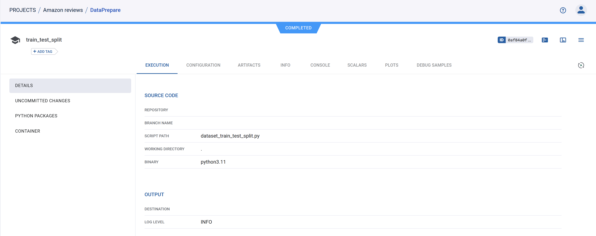
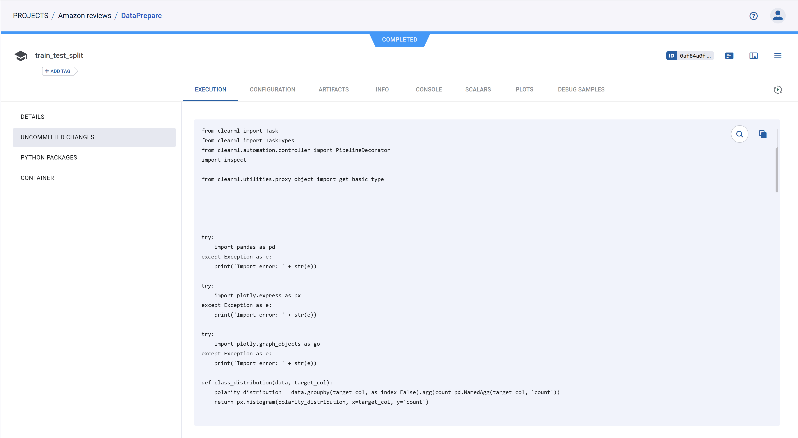
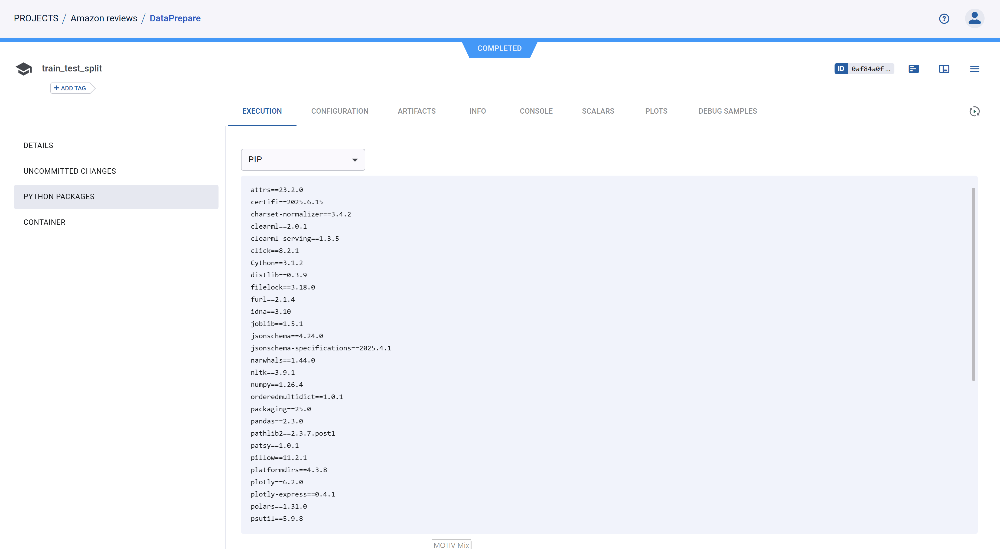
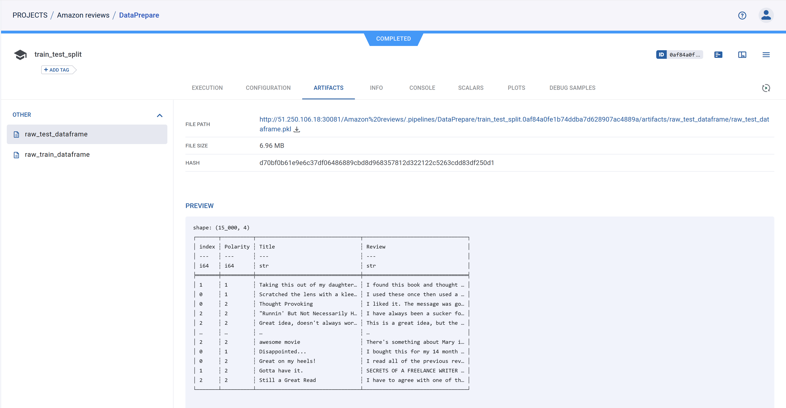
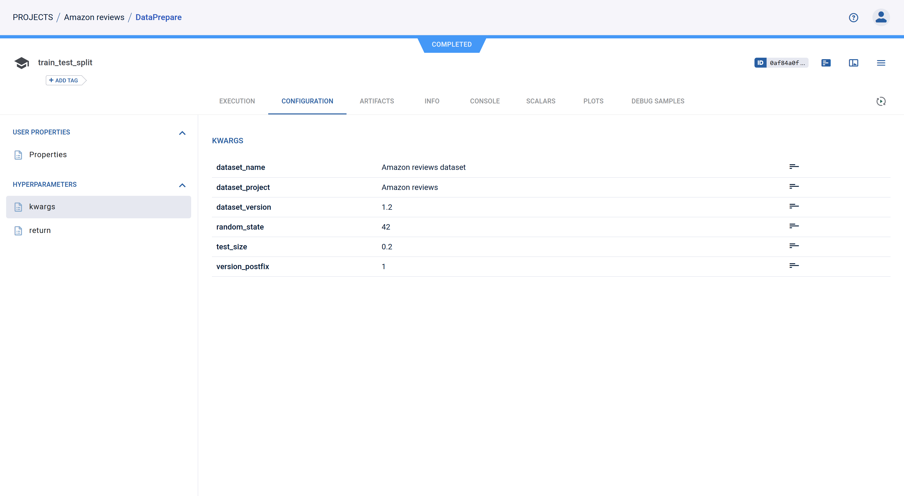

# ClearML Pipelines

Теперь разберем работу с ClearML agent и ClearML pipeline.

## Настойка ClearML agent

Быстрый его запуск разобран в [2. clearml_yandex_kube.md](2. clearml_yandex_kube.md), сейчас мы уделим внимание его более детальной настройки и чуть-уть разберем его helm chart.

Весь перечень параметров представлен в репозитории [clearml-helm-charts](https://github.com/levkovalenko/clearml-helm-charts/tree/main/charts/clearml-agent)

1. Стоит уделить внимание версии самого ClearML-agent, на момент подготовки курса доступна версия 1.9.3, но она не корректно работает с задачами в очереди (см. [issue](https://github.com/clearml/clearml-agent/issues/223)). Поэту ставим специально понижаем версию до последней рабочей.
```yaml
agentk8sglue:
  ...
  extraEnvs:
  - name: CLEARML_AGENT_UPDATE_VERSION
    value: "==1.9.2"
```

2. Также стоит изменить образ который будет использоваться для запуска задач на нужный вам (возможно кастомный). Опять же советую использовать python не выше `3.11`, что бы не возникало проблем с использованием более тсарых версий библиотек на следующих этапах.
```yaml
agentk8sglue:
  ...
  defaultContainerImage: python:3.11.13-slim-bookworm
```

3. Внеся такие изменения вы в целом можете разворачивать его на kubernetes и использовать для выполнения пайплайнов и экспериментов.

## ClearML pipeline

ClearML позволяет составлять пайплайны, формируя их из существующих задач или прописывая специализированный код используя [pipeline SDK](https://clear.ml/docs/latest/docs/references/sdk/automation_controller_pipelinecontroller/). Сейчас мы разберем пример pipeline реализованного с помощью `PipelineController`, для этого надо посмотреть в файл [2.train_test_split.py](2.train_test_split.py), давайте его запустим:
```bash
pixi run python mlops-example/2.train_test_split.py
```
А пока он исполняется, разберем код пайплайна:

1. Создается основной объект пайплайна, ему указывается имя, проект, версия, специальные зависимости, докер образ для исполнения и возможность локального импорта модулей. Далее мы будем работать с этим объектом и его донастраивать. 
```python
pipe = PipelineController(
    name="DataPrepare",
    project="Amazon reviews",
    version="0.0.1",
    packages=["./mlops-example", "numpy==1.26.4"],
    docker="python:3.11.13-slim-bookworm",
    enable_local_imports=True,
)
```

2. Пайплайну задаются основные параметры, которые в дальнейшем мы сможем задавать в интерфейсе clearml.
```python
pipe.add_parameter(
    name="dataset_name",
    description="ClearML dataset name",
    default="Amazon reviews dataset",
)
pipe.add_parameter(
    name="dataset_project",
    description="ClearML project",
    default="Amazon reviews",
)
pipe.add_parameter(
    name="dataset_version",
    description="ClearML dataset version",
    default="1.2",
)
pipe.add_parameter(
    name="test_size", description="Test ratio size", default=0.2, param_type="float"
)
pipe.add_parameter(
    name="random_state", description="Random state", default=42, param_type="int"
)
```


3. Далее описываются функции, которые будут исполняться. Обратит внимание Что основные импорты находятся внутри функции, это позволяет clearml автоматически считать зависимости которые необходимы для работы этого кода, но на практике лучше вручную задавать зависимости для каждого шага, что бы установить корректные версии библиотек. Здесь пример функции которая занимается разделение данные на train и test, и складывает их в новую версию датасета: `X.X.1`.
```python
def dataset_train_test_split(
    dataset_name,
    dataset_project,
    dataset_version,
    test_size,
    random_state,
    version_postfix,
):
    from pathlib import Path

    import pandas as pd
    import polars as pl
    import pyarrow
    from clearml import Dataset, Logger
    from sklearn.model_selection import train_test_split

    print(pyarrow.__version__)

    dataset = Dataset.get(
        dataset_name=dataset_name,
        dataset_project=dataset_project,
        dataset_version=dataset_version,
    )
    datset_path = Path(dataset.get_local_copy())

    data: pd.DataFrame = pl.concat(
        [pl.read_csv(data_file) for data_file in datset_path.iterdir()]
    )
    train, test = train_test_split(
        data.to_pandas(), test_size=float(test_size), random_state=int(random_state)
    )
    train_distrib = class_distribution(train, "Polarity")
    test_distrib = class_distribution(test, "Polarity")
    result_path = Path("data/prepared/split")
    result_path.mkdir(exist_ok=True, parents=True)
    train.to_csv(result_path / "raw_train.csv", index=False)
    test.to_csv(result_path / "raw_test.csv", index=False)
    prepared_dataset = Dataset.create(
        dataset_name=dataset_name,
        dataset_project=dataset_project,
        dataset_version=f"{dataset_version}.{version_postfix}",
        parent_datasets=[dataset],
    )
    prepared_dataset.add_files(result_path)
    prepared_dataset.upload()
    prepared_dataset.get_logger().report_plotly(
        "Class distribution", "Train", train_distrib
    )
    prepared_dataset.get_logger().report_plotly(
        "Class distribution", "Test", test_distrib
    )
    prepared_dataset.finalize()

    pipe_logger = Logger.current_logger()
    pipe_logger.report_plotly("Class distribution", "Train", train_distrib)
    pipe_logger.report_plotly("Class distribution", "Test", test_distrib)
    return (
        pl.from_pandas(train, include_index=False),
        pl.from_pandas(test, include_index=False),
        prepared_dataset.id,
    )
```

4. Добавляем первый функциональный шаг, указываем его имя, функцию которая его исполняет, ее аргументы, используя параметры pipeline, так же указываем какие артефакты сохранить на этом шаге в качестве возвращаемых значений функции, указываем что этот шаг может быть закеширован,
указываем очередь для передачи ее ClearML agent, если вы ее не настраивали, то это default,
Так же у нас идут helper fucntions, они нужны что бы код шага корректно сгенерировался, и наконец специфичные зависимости для шага.
```python
pipe.add_function_step(
    name="train_test_split",
    function=dataset_train_test_split,
    function_kwargs=dict(
        dataset_name="${pipeline.dataset_name}",
        dataset_project="${pipeline.dataset_project}",
        dataset_version="${pipeline.dataset_version}",
        test_size="${pipeline.test_size}",
        random_state="${pipeline.random_state}",
        version_postfix="1",
    ),
    function_return=["raw_train_dataframe", "raw_test_dataframe", "splited_dataset_id"],
    cache_executed_step=True,
    execution_queue="default",
    helper_functions=[class_distribution],
    packages=[
        "plotly>=6.2.0,<7",
        "plotly-express>=0.4.1,<0.5",
        "clearml-serving>=1.3.5,<2",
        "scikit-learn==1.2.2",
        "numpy==1.26.4",
        "pandas>=2.3.0,<3",
        "polars>=1.31.0,<2",
        "nltk>=3.9.1,<4",
        "pyarrow>=20.0.0,<21",
    ],
)
```
Еще стоит сказать про особенность `function_step`, в нем ваш код будет преобразован в отдельный скрипт который будет исполняться, поэтому есть такие проблемы с import разных библиотек и тд. Вот пример кода для этого шага, который переработал ClearML:
```python
from clearml import Task
from clearml import TaskTypes
from clearml.automation.controller import PipelineDecorator
import inspect

from clearml.utilities.proxy_object import get_basic_type


try:
    import pandas as pd
except Exception as e:
    print('Import error: ' + str(e))

try:
    import plotly.express as px
except Exception as e:
    print('Import error: ' + str(e))

try:
    import plotly.graph_objects as go
except Exception as e:
    print('Import error: ' + str(e))

def class_distribution(data, target_col):
    polarity_distribution = data.groupby(target_col, as_index=False).agg(count=pd.NamedAgg(target_col, 'count'))
    return px.histogram(polarity_distribution, x=target_col, y='count')

try:
    from clearml import PipelineController
except Exception as e:
    print('Import error: ' + str(e))

try:
    from mlops_example.preprocessing import dataframe_preprocessing
except Exception as e:
    print('Import error: ' + str(e))

try:
    from mlops_example.preprocessing import lemmatize
except Exception as e:
    print('Import error: ' + str(e))

try:
    from mlops_example.preprocessing import text_preprocessing
except Exception as e:
    print('Import error: ' + str(e))

try:
    from mlops_example.visualisation import class_distribution
except Exception as e:
    print('Import error: ' + str(e))

def dataset_train_test_split(dataset_name, dataset_project, dataset_version, test_size, random_state, version_postfix):
    from pathlib import Path
    import pandas as pd
    import polars as pl
    import pyarrow
    from clearml import Dataset, Logger
    from sklearn.model_selection import train_test_split
    print(pyarrow.__version__)
    dataset = Dataset.get(dataset_name=dataset_name, dataset_project=dataset_project, dataset_version=dataset_version)
    datset_path = Path(dataset.get_local_copy())
    data: pd.DataFrame = pl.concat([pl.read_csv(data_file) for data_file in datset_path.iterdir()])
    train, test = train_test_split(data.to_pandas(), test_size=float(test_size), random_state=int(random_state))
    train_distrib = class_distribution(train, 'Polarity')
    test_distrib = class_distribution(test, 'Polarity')
    result_path = Path('data/prepared/split')
    result_path.mkdir(exist_ok=True, parents=True)
    train.to_csv(result_path / 'raw_train.csv', index=False)
    test.to_csv(result_path / 'raw_test.csv', index=False)
    prepared_dataset = Dataset.create(dataset_name=dataset_name, dataset_project=dataset_project, dataset_version=f'{dataset_version}.{version_postfix}', parent_datasets=[dataset])
    prepared_dataset.add_files(result_path)
    prepared_dataset.upload()
    prepared_dataset.get_logger().report_plotly('Class distribution', 'Train', train_distrib)
    prepared_dataset.get_logger().report_plotly('Class distribution', 'Test', test_distrib)
    prepared_dataset.finalize()
    pipe_logger = Logger.current_logger()
    pipe_logger.report_plotly('Class distribution', 'Train', train_distrib)
    pipe_logger.report_plotly('Class distribution', 'Test', test_distrib)
    return (pl.from_pandas(train, include_index=False), pl.from_pandas(test, include_index=False), prepared_dataset.id)

if __name__ == '__main__':
    task = Task.init(
        auto_connect_frameworks=True,
        auto_connect_arg_parser=True,
    )
    kwargs = {'dataset_name': '${pipeline.dataset_name}', 'dataset_project': '${pipeline.dataset_project}', 'dataset_version': '${pipeline.dataset_version}', 'test_size': '${pipeline.test_size}', 'random_state': '${pipeline.random_state}', 'version_postfix': '1'}
    task.connect(kwargs, name='kwargs')
    function_input_artifacts = {}
    params = task.get_parameters(cast=True) or dict()
    argspec = inspect.getfullargspec(dataset_train_test_split)
    if argspec.varkw is not None or argspec.varargs is not None:
        for k, v in params.items():
            if k.startswith('kwargs/'):
                kwargs[k.replace('kwargs/', '', 1)] = v
    return_section = 'return'
    for k, v in params.items():
        if not v or not k.startswith('kwargs_artifacts/'):
            continue
        k = k.replace('kwargs_artifacts/', '', 1)
        task_id, artifact_name = v.split('.', 1)
        parent_task = Task.get_task(task_id=task_id)
        if artifact_name in parent_task.artifacts:
            kwargs[k] = parent_task.artifacts[artifact_name].get(deserialization_function=None)
        else:
            kwargs[k] = parent_task.get_parameters(cast=True).get(return_section + '/' + artifact_name)
    if '0' in kwargs:  # *args arguments are present
        pos_args = [kwargs.pop(arg, None) for arg in (argspec.args or [])]
        other_pos_args_index = 0
        while str(other_pos_args_index) in kwargs:
            pos_args.append(kwargs.pop(str(other_pos_args_index)))
            other_pos_args_index += 1
        results = dataset_train_test_split(*pos_args, **kwargs)
    else:
        results = dataset_train_test_split(**kwargs)
    result_names = ['raw_train_dataframe', 'raw_test_dataframe', 'splited_dataset_id']
    if result_names:
        if not isinstance(results, (tuple, list)) or len(result_names) == 1:
            results = [results]
        parameters = dict()
        parameters_types = dict()
        for name, artifact in zip(result_names, results):
            if type(artifact) in (float, int, bool, str):
                parameters[return_section + '/' + name] = artifact
                parameters_types[return_section + '/' + name] = get_basic_type(artifact)
            else:
                task.upload_artifact(
                    name=name,
                    artifact_object=artifact,
                    extension_name='.pkl' if isinstance(artifact, dict) else None,
                    serialization_function=None
                )
        if parameters:
            task._set_parameters(parameters, __parameters_types=parameters_types, __update=True)
```

5. Прописываем все функцию для препроцессинга данных с помощью nltk.
```python
def dataset_preprocessing(
    dataframe,
    parent_dataset,
    dataset_name,
    dataset_project,
    dataset_version,
    version_postfix,
    frame_name,
):
    from pathlib import Path

    import nltk
    import polars as pl
    import pyarrow
    from clearml import Dataset

    print(pyarrow.__version__)

    nltk.download("stopwords")
    nltk.download("wordnet")

    prepared_dataset = Dataset.create(
        dataset_name=dataset_name,
        dataset_project=dataset_project,
        dataset_version=f"{dataset_version}.{version_postfix}",
        parent_datasets=[parent_dataset],
    )
    dataframe: pl.DataFrame
    processed_dataframe = dataframe_preprocessing(dataframe, "Review")

    result_path = Path("data/prepared/processed")
    result_path.mkdir(exist_ok=True, parents=True)
    processed_dataframe.write_parquet(result_path / f"processed_{frame_name}.parquet")

    prepared_dataset.add_files(result_path)
    prepared_dataset.upload()
    prepared_dataset.finalize()
    return processed_dataframe, prepared_dataset.id
```

6. И задаем для нее два шага, для обработки обучающей и тестовой выборок. Можно заметить что в параметризации функции у нас также используются и сохраненные артефакты шага`train_test_split`, а также появился параметр parents, позволяющий строить пайплайн. Кстати, эти шаги будут выполняться паралельно.
```python
pipe.add_function_step(
    name="train_processing",
    function=dataset_preprocessing,
    function_kwargs=dict(
        dataframe="${train_test_split.raw_train_dataframe}",
        parent_dataset="${train_test_split.splited_dataset_id}",
        dataset_name="${pipeline.dataset_name}",
        dataset_project="${pipeline.dataset_project}",
        dataset_version="${pipeline.dataset_version}",
        version_postfix="2",
        frame_name="train",
    ),
    function_return=["processed_train_dataframe", "dataset_id"],
    cache_executed_step=True,
    execution_queue="default",
    helper_functions=[lemmatize, dataframe_preprocessing, text_preprocessing],
    parents=["train_test_split"],
    packages=[
        "plotly>=6.2.0,<7",
        "plotly-express>=0.4.1,<0.5",
        "clearml-serving>=1.3.5,<2",
        "scikit-learn==1.2.2",
        "numpy==1.26.4",
        "pandas>=2.3.0,<3",
        "polars>=1.31.0,<2",
        "nltk>=3.9.1,<4",
        "pyarrow>=20.0.0,<21",
    ],
)

pipe.add_function_step(
    name="test_processing",
    function=dataset_preprocessing,
    function_kwargs=dict(
        dataframe="${train_test_split.raw_test_dataframe}",
        parent_dataset="${train_test_split.splited_dataset_id}",
        dataset_name="${pipeline.dataset_name}",
        dataset_project="${pipeline.dataset_project}",
        dataset_version="${pipeline.dataset_version}",
        version_postfix="3",
        frame_name="test",
    ),
    function_return=["processed_test_dataframe", "dataset_id"],
    cache_executed_step=True,
    execution_queue="default",
    helper_functions=[lemmatize, dataframe_preprocessing, text_preprocessing],
    parents=["train_test_split"],
    packages=[
        "plotly>=6.2.0,<7",
        "plotly-express>=0.4.1,<0.5",
        "clearml-serving>=1.3.5,<2",
        "scikit-learn==1.2.2",
        "numpy==1.26.4",
        "pandas>=2.3.0,<3",
        "polars>=1.31.0,<2",
        "nltk>=3.9.1,<4",
        "pyarrow>=20.0.0,<21",
    ],
)
```

6. Теперь непосредственно команда запуска. Есть два варианта запуска `start` и `start_locally`.Первая (`start`) запускает сборку и исполнение pipeline на стороне агента, то есть агент установит окружение пайплайна и начнемт подготовку кода для каждого из шагов, затем непосредсвенно начнет выполнение шагов. По сути это не блокирующая команда которая направляет задачу агенту и он ее выполняет. Второй вариант `start_locally` позволяет сконфигурировать пайплайн локлаьно и только шаги исполнить удаленно, но если указать `start_locally(run_pipeline_steps_locally=True)`, то и шаги пайплайна будут исполнены локально, что может быть удобно для дебага.
```python
pipe.start()
```
Вы можете перейти в clearml и увидеть что ваш pipeline выполняется:

Посмотреть его логи можно в поде `clearml-id-xxxxxxx`:

Или в консоле пайплайна.

7. Когда пайплайн завершился, можно посотреть всю инфомрацию о нем: настройки, изменения, заисимости, артефакты и тд.






8. Теперь мы легко можем запускать этот пайплайн для других верси датасета, для этого надо клинкнуть по нему пкм и надать run, тогда появится окно задания настрое, напрмиер поставим версию `1.3`.


В процессе вы увидите что у вас динамически создаются worker для обработки шагов пайплайна
