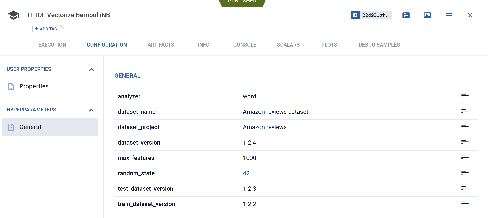
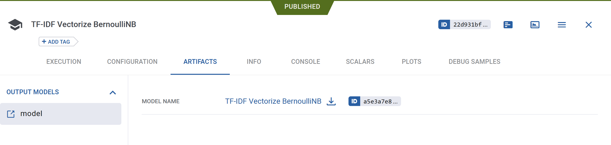
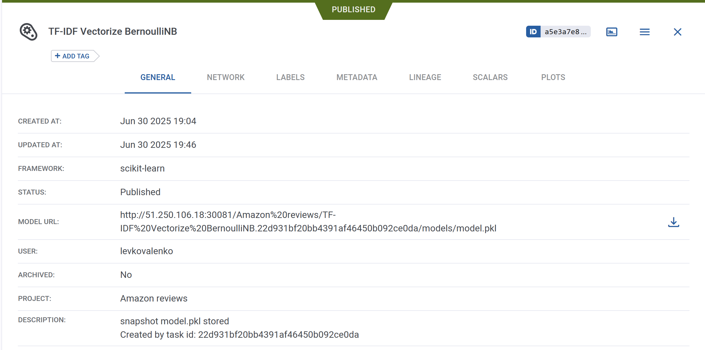
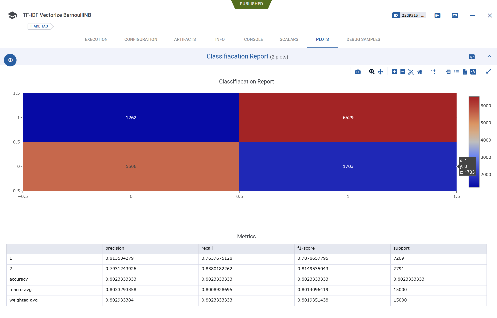
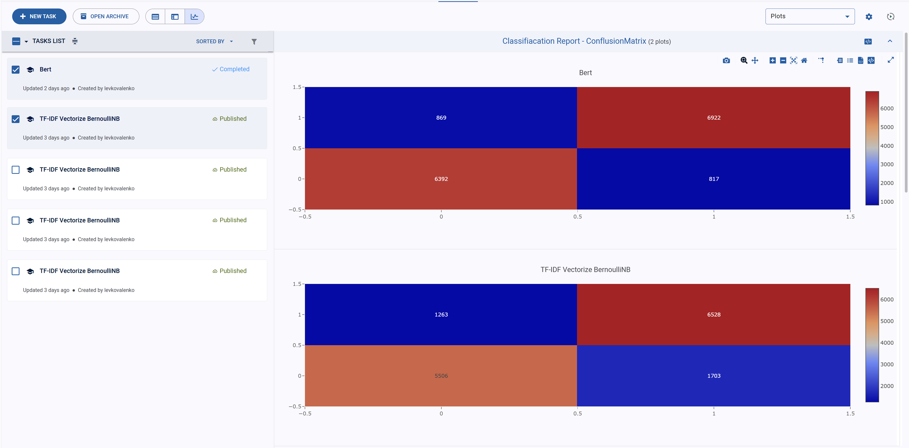

# ClearML Research

Теперь разберем самое интересное -- как можно в ClearML проводить исследования. ClearML предоставляет комплексную платформу для управления ML-экспериментами:
- **Автоматическое отслеживание** кода, параметров, метрик и артефактов
- **Воспроизводимость** экспериментов через фиксацию данных, кода и зависимостей
- **Масштабирование** с помощью удаленных агентов
- **Сравнение экспериментов** через веб-интерфейс


Ниже объясняется как проводить исследования с примерами из [3.tf_idf.py](mlops-example/3.tf_idf.py) и [4.bert_amazon.ipynb](mlops-example/4.bert_amazon.ipynb)

## Ключевые шаги исследований в ClearML

1. Инициализация задачи. Каждый эксперимент начинается с инициализации задачи, вот небольшой пример, но стоит посмотреть на [документацию](https://clear.ml/docs/latest/docs/clearml_sdk/task_sdk/).
```python
from clearml import Task
task = Task.init(
    project_name="Amazon reviews",
    task_name="TF-IDF Vectorize BernoulliNB",  # или "Bert"
    output_uri=True  # Автоматическое логирование артефактов
)
```

2. Управление конфигурацией. ClearML позволяет настроить отслеживание гиперпараметров и настроек:
```python
args = {
    "random_state": 42,
    "max_features": 1000,
    "analyzer": "word"
}
task.connect(args)  # Логирует параметры в ClearML
```



3. Стоит использовать не локальные данные, а данные которые у нас уже преобразованы в датасет. Это обеспечивает воспроизводимость:
```python
from clearml import Dataset

# Получение конкретной версии датасета
train_dataset = Dataset.get(
    dataset_name="Amazon reviews dataset",
    dataset_project="Amazon reviews",
    dataset_version="1.2.1"  # Фиксация версии
)
frame_path = train_dataset.get_local_copy()
```


4. Обучение моделей и их логирование. Для этого у clearml есть специальный класс который позволяет задавать специальные артефакты--модели, которые в дальнейшем можно будет засерверить.

```python
from clearml import OutputModel

pipe = Pipeline([
    ("tfidf", TfidfVectorizer()),
    ("bernoulli", BernoulliNB())
])
pipe.fit(train_x, train_y)

# Сохранение и логирование модели
joblib.dump(pipe, "model.pkl")
output_model = OutputModel(task=task, framework="scikit-learn")
output_model.update_weights(weights_filename="model.pkl")
```




5. Отслеживание экспериментов и метрик может производиться как в отношении эксперимента, так и отдельных артефактов моделей/датасетов, ниже приведен пример как можно залогировать classification_report и он будет сохранен и в задании и в описании модели.
```python
import pandas as pd
from sklearn.metrics import classification_report
from clearml import Logger

logger: Logger = task.get_logger()

pred_y = pipe.predict(test_x["corpus"])
classification_report_table = pd.DataFrame(
    classification_report(test_y, pred_y, output_dict=True)
).T
logger.report_table(
    "Classifiacation Report", "Metrics", table_plot=classification_report_table
)
output_model.report_table(
    "Classifiacation Report", "Metrics", table_plot=classification_report_table
)
classification_report_table
```



6. Можно заниматься логированием отдельных артефактов в задания, например эмбендингов полученных от bert'a, что бы использовать их в других экспериментах.

```python
# Загрузка эмбеддингов (пример BERT)
task.upload_artifact("train_embeddings", train_embeddings)
```

7. ClearML автоматически фиксирует:
- Консольный вывод
- Исходный код (с созданием Git-снимка)
- Установленные зависимости
- Системные метрики (CPU/GPU/память)
Для этого не требуется дополнительный код.

8. Сравнение экспериментов
в ClearML есть [инструменты](https://clear.ml/docs/latest/docs/webapp/webapp_exp_comparing/) для сравнения экспериментов, вы можете легко сравнивать результаты разных экспериментов и графики и метрики.



## Шаги рабочего процесса
1. **Инициализация задачи**: Начните отслеживание перед выполнением кода
2. **Конфигурация параметров**: Используйте `task.connect()` для воспроизводимости и повторных удаленных запусков на clearml agent с другими параметрами.
3. **Версионирование данных**: Выбирайте версии датасетов через `Dataset.get()`, и лучше установить версию как параметр, что бы вы легко могли воспроизвести эксперимент на следующих инкрементах данных. 
4. **Выполнение эксперимента**:
   - Автоматическое/ручное логирование метрик
   - Сохранение моделей через `OutputModel`
   - Логирование артефактов через `task.upload_artifact()`
5. **Финализация**: `task.mark_completed()` -- по завершении пометьте эксперимент выполненным
6. **Воспроизведение**:
   - Клонирование задачи через веб-интерфейс
   - Запуск на удаленном агенте с новыми параметрами
7. **Сравнение экспериментов** с различными параметрами в веб интерфейсе
