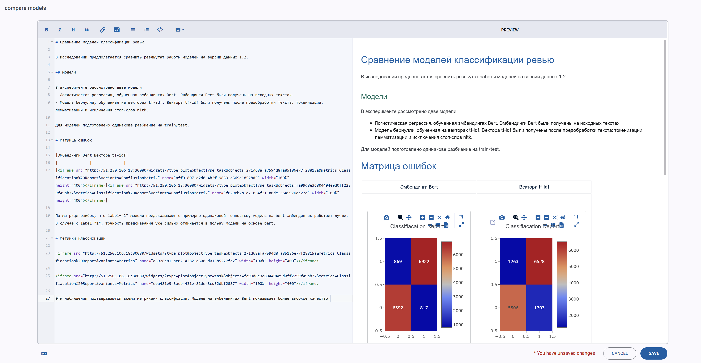

# ClearML Reports

ClearML предоставляет мощные инструменты для создания отчетов о результатах экспериментов. Отчеты позволяют документировать и визуализировать результаты исследований, сравнивать разные эксперименты и делиться выводами с командой.

## Основные возможности отчетов:
1. **CodeLess отчеты** на основе залогированных метрик и артефактов
2. **Сравнение экспериментов** в табличном или графическом виде
3. **Встраивание визуализаций** (графики, таблицы, изображения)
4. **Версионирование** отчетов вместе с экспериментами

## Работа с отчетами через веб-интерфейс:
1. **Создание**: 
   - В разделе Reports → Create New Report
   - Используйте визуальный редактор или Markdown

2. **Написание отчета**
    - Описывайте постановку задачи/эксперимента/исследования
    - Прикладывайте результаты различных экспериментов и описывайте их
    - Фиксируйте свои наблюдения и предположения

3. **Ревью отчета**
    - Обсуждайте результаты с коллегами
    - Фиксируйте вопросы к отчетам и замечаниям
    - Правьте отчет и дополняйте его
    - После его полной финализации -- опубликуйте его
