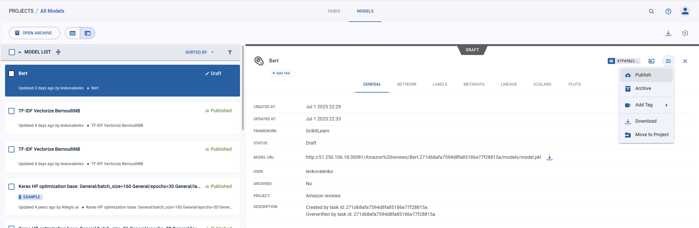
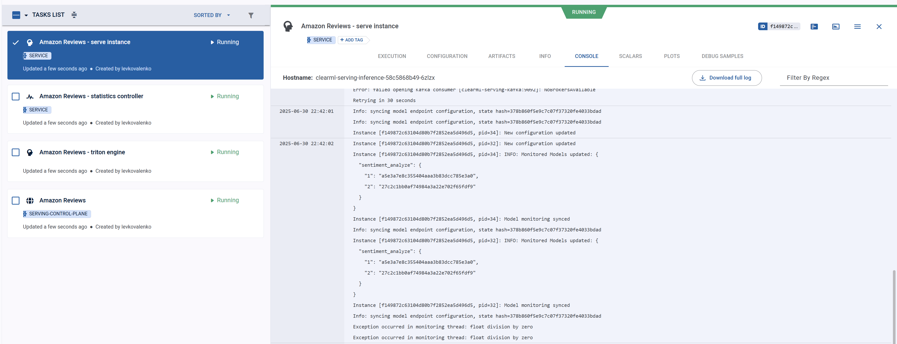

# ClearML Servering

## Базовая настрйока

1. Установите clearml-serving
```bash
pixi add --pypi clearml-serving
pixi install -a
```

2. Создайте clearml serving controller:
```bash
pixi run clearml-serving create --name  "Amazon Reviews"
```
Получите его `ID` для развертки clearml-serving в kubernetess
```
New Serving Service created: id=3e0e2ce884444da694fb774ef94ecc5f
```

3. Перейдите к инструкции из [2. clearml_yandex_kube.md](./2.%20clearml_yandex_kube.md). Используйте полученный `ID` как `SERVERINGID`. Обратите внимание, что в serving нужно добавить зависимости в `values.yaml`
```yaml
clearml_serving_inference:
  ...
  extraPythonPackages:
  - nltk==3.9.1
  - polars>=1.31.0,<2
```

4. Далее работаем с clearml-serving, (Вот тут [документация](https://clear.ml/docs/latest/docs/clearml_serving/clearml_serving_cli))

## Добвавлние моделей

1. Стоит опубликовать вашу модель, которую вы хотите использовать, выберете в атефактах вашу модель и нажмите publish в ее меню.


2. Далее нужно подготовить prepreprocessing для данных на вход модели, варианты можно найти в [примерах](https://github.com/clearml/clearml-serving/tree/main/examples). Вам нужно по сути написать класс  `Preprocessing` в виде класса в фалйле, вот пример для подготовки данных в tf-idf
```python
class Preprocess(object):
    def __init__(self):
        # set internal state, this will be called only once. (i.e. not per request)
        pass

    def preprocess(
        self, body: dict, state: dict, collect_custom_statistics_fn=None
    ) -> Any:
        # we expect to get two valid on the dict x0, and x1
        text = body.get("text", None)
        processed_words = text_preprocessing(text).split(" ")
        lemmatizer = WordNetLemmatizer()
        processed_text = " ".join(
            [lemmatizer.lemmatize(token) for token in processed_words]
        )
        return [processed_text]

    def postprocess(
        self, data: Any, state: dict, collect_custom_statistics_fn=None
    ) -> dict:
        # post process the data returned from the model inference engine
        # data is the return value from model.predict we will put is inside a return value as Y
        return dict(y=data.tolist() if isinstance(data, np.ndarray) else data)
```

3. Добавьте модель в serving:
```bash
pixi run clearml-serving --id 3e0e2ce884444da694fb774ef94ecc5f model auto-update --engine sklearn --endpoint "sentiment_analyze" --published --project "Amazon reviews" --name "TF-IDF Vectorize BernoulliNB" --max-versions 5 --preprocess "mlops-example/mlops_example/preprocessing.py"
```
Вот разбор команды:
  - Указываем `--id   3e0e2ce884444da694fb774ef94ecc5f` созданного   контроллера
  - Выбираем режим модели `model auto-update` для   автообновления при публикации новых моделей
  - Указываем фреймворк модели `--engine sklearn`   (см [документацию](https://clear.ml/docs/latest/docs/clearml_serving/clearml_serving_cli#auto-update))
  - Определяем ендпоинт для доступа к модели `--endpoint "sentiment_analyze"`
  - Указываем параметры модели: опубликованные модели `--published` определенного проекта `--project "Amazon reviews"` под названием `--name "TF-IDF Vectorize BernoulliNB"`
  - Максимальное количество версий модели которые могут быть запущены `--max-versions 5`
  - Указываем скрипт препроцессинга `--preprocess "mlops-example/mlops_example/preprocessing.py"`

4. Теперь перейдите в  проект DevOps, там в задаче `Amazon Reviews - serve instance` будут логи добавления модели.

Так же можете выполнить команду:
```bash
pixi run clearml-serving --id 3e0e2ce884444da694fb774ef94ecc5f model list
```
И увидеть что модели загружены:
```json
clearml-serving - CLI for launching ClearML serving engine
List model serving and endpoints, control task id=3e0e2ce884444da694fb774ef94ecc5f
Info: syncing model endpoint configuration, state hash=378b860f5e9c7c07f37320fe4033bdad
Endpoints:
{}
Model Monitoring:
{
  "sentiment_analyze": {
    "base_serving_url": "sentiment_analyze",
    "engine_type": "sklearn",
    "monitor_project": "Amazon reviews",
    "monitor_name": "TF-IDF Vectorize BernoulliNB",
    "monitor_tags": [],
    "only_published": true,
    "max_versions": 5,
    "input_size": null,
    "input_type": null,
    "input_name": null,
    "output_size": null,
    "output_type": null,
    "output_name": null,
    "preprocess_artifact": "py_code_sentiment_analyze",
    "auxiliary_cfg": null
  }
}
Canary:
{}
```

## Тестирвоание модели

Попробуем потестировать модель, сразу оговорюсь нужно делать тесты мз сети yc, так как для моделей не проброшены внешние порты, для этого можно развернуть виртуалку. Попробуем первый запрос, мы будем обращатсья к модели с `ID=27c2c1bb0af74984a3a22e702f65fdf9`, поэтому в url укзываем версию 2.
```bash
curl -X POST "http://10.112.135.102:8080/serve/sentiment_analyze/2" -H "accept: application/json" -H "Content-Type: application/json" -d "{\"text\": \"Taking this out of my daughter's library, I found this book and thought the illustrtions were absolutey beautiful -- a true work of artistry. However, I didn't read it through before I bought it. I was reading it to my daughter when I discovered how disturbing the story turns with the spanking scenes. I stopped reading the book and I will take it out of my house.\"}"
```
Ответ модели: `{"y":[2]}`

Теперь второй запрос:
```bash
curl -X POST "http://10.112.135.102:8080/serve/sentiment_analyze/2" -H "accept: application/json" -H "Content-Type: application/json" -d "{\"text\": \"Scratched the lens with a kleenex,I used these once then used a Kleenex to wipe one lens that was a little smudged. I have microscopic vision and I noticed it was scratched AFTER I used the Kleenex, so to be sure, I used it again and sure enough, it scratched the lens some more. I compared the 2 lenses and the other lens looked pristine, whereas the one I used the kleenex on was scratched all over Very low quality lenses! Unusable after one use\"}"
```
Ответ модели: `{"y":[1]}`

Видим что модель работает и названачет соотвествующие лейблы. Отлично у вас есть развернутая модель которую можно использовать и отправлять ей разные запросы.