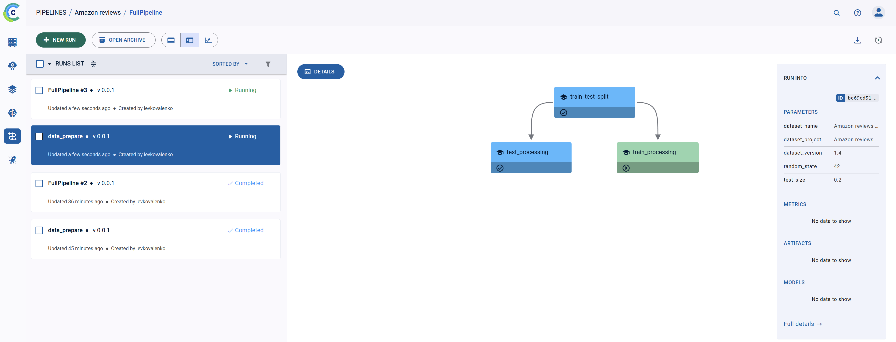
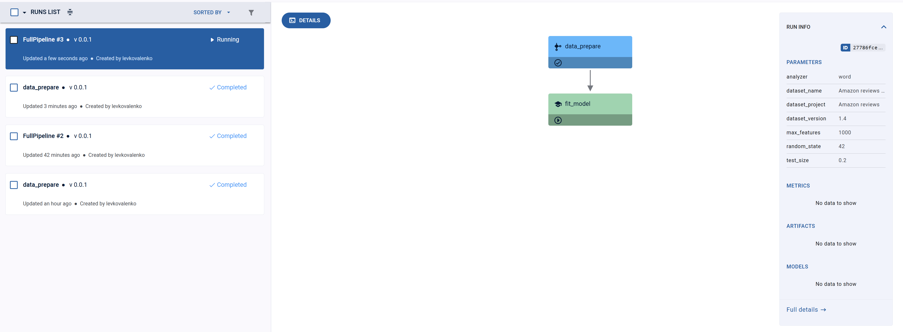

# Расширение ClearML pipelines

Еще немного вернемся к пайплайнам, кроме пайплайнов из кодакак это было показано в [5. clearml_pipeline.md](5.%20clearml_pipeline.md), можно создавать пайплайны из задач. Давайте разбремся, что для этого надо и рассмотрим файл [mlops-example/5.full_pipe.py](./mlops-example/5.full_pipe.py).

1. Точно также инициализируем пайплайн, как делали ранее и задаем ему все необходимые параметры:
```python
from clearml import PipelineController

pipe = PipelineController(
    name="FullPipeline",
    project="Amazon reviews",
    version="0.0.1",
    packages=["./mlops-example"],
    docker="python:3.11.13-slim-bookworm",
    enable_local_imports=True,
    # working_dir="./mlops-example",
)

pipe.add_parameter(
    name="dataset_name",
    description="ClearML dataset name",
    default="Amazon reviews dataset",
)
pipe.add_parameter(
    name="dataset_project",
    description="ClearML project",
    default="Amazon reviews",
)
pipe.add_parameter(
    name="dataset_version",
    description="ClearML dataset version",
    default="1.2",
)
pipe.add_parameter(
    name="test_size", description="Test ratio size", default=0.2, param_type="float"
)
pipe.add_parameter(
    name="random_state", description="Random state", default=42, param_type="int"
)
pipe.add_parameter(
    name="max_features",
    description="Tf-idf features limit",
    default=1000,
    param_type="int",
)
pipe.add_parameter(
    name="analyzer",
    description="Tf-idf analyzer",
    default="word",
    param_type="str",
)
```

2. Зададим первый шаг и включим в него весь пайплайн подгтовки данных из [mlops-example/5.full_pipe.py](./mlops-example/5.full_pipe.py). В нем указываем `base_task_id="1ecd1cacb1db4f40a362a67d629fe14f"`, которая определит задачу которая должна выполняться на этом шаге, переопределим ее параметрыи донастроим. По паараметрам, их нужно писать так: `Section/Param name`, что бы корректно переопределеить. 
```python
pipe.add_step(
    name="data_prepare",
    base_task_id="1ecd1cacb1db4f40a362a67d629fe14f",
    parameter_override={
        "Args/dataset_name": "${pipeline.dataset_name}",
        "Args/dataset_project": "${pipeline.dataset_project}",
        "Args/dataset_version": "${pipeline.dataset_version}",
        "Args/random_state": "${pipeline.random_state}",
        "Args/test_size": "${pipeline.test_size}",
    },
    cache_executed_step=True,
    execution_queue="default",
)
```
В результате при выполнении у нас будет запускаться дополнительно этот пайплайн


3. Задаим шаг на основе [mlops-example/3.tf_idf.py](./mlops-example/3.tf_idf.py), работа с ним описана в  [6. clearml_research.md](./6.%20clearml_research.md). Точно также указываем `base_task_id="b5217b5ef85e4e4aa630c672f8177973"` из clearml и переопределяем параметры, а также указываем что следует она после выполнения подпайплайна `data_prepare`.
```python
pipe.add_step(
    name="fit_model",
    base_task_id="b5217b5ef85e4e4aa630c672f8177973",
    parameter_override={
        "General/dataset_name": "${pipeline.dataset_name}",
        "General/dataset_project": "${pipeline.dataset_project}",
        "General/train_dataset_version": "${pipeline.dataset_version}.2",
        "General/test_dataset_version": "${pipeline.dataset_version}.3",
        "General/dataset_version": "${pipeline.dataset_version}.4",
        "General/random_state": "${pipeline.random_state}",
        "General/max_features": "${pipeline.max_features}",
        "General/analyzer": "${pipeline.analyzer}",
    },
    parents=["data_prepare"],
    cache_executed_step=True,
    execution_queue="default",
)
```
После выполнения подпайплайна `data_prepare` переходит к выполнению этой задачи. И так у нас есть цельный пайплайн по обработке данных и обучению модели, который мы можем запустить на любой версии данных.
